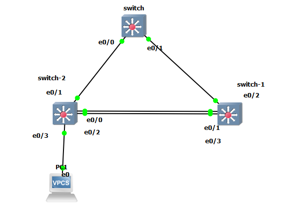
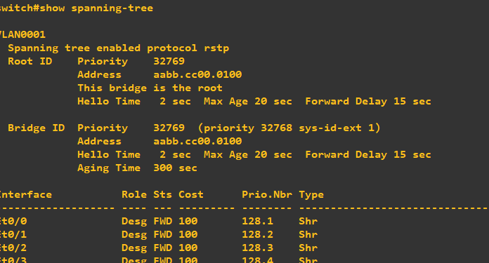
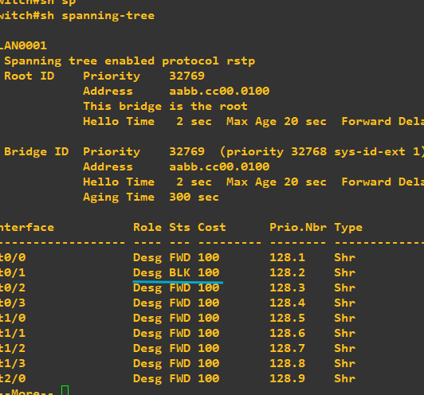
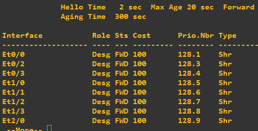
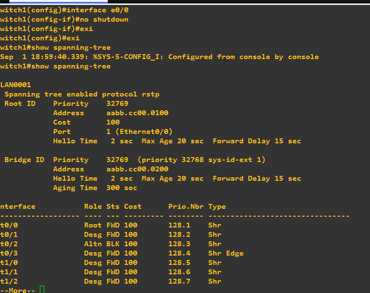
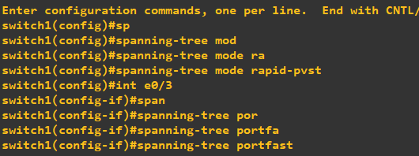
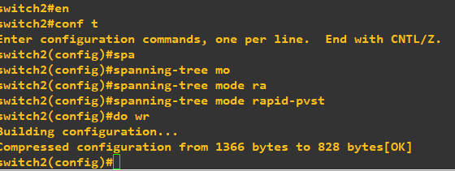

# STP Configuration (Spanning Tree Protocol)

## Goal
Build a redundant switched topology with a network loop, and use STP
(Rapid-PVST+) to automatically block the redundant path while keeping
it as a standby link. Verify Root Bridge election, port blocking,
PortFast on the access port, and failover/recovery behavior when a
link goes down and comes back up.

## Topology

- **switch** (Root Bridge) — connected to switch-2 (e0/0) and switch-1 (e0/1)
- **switch-2** and **switch-1** — connected to each other with a
  redundant double link, creating a Layer 2 loop
- **PC1** — connected to switch-2 (e0/3), an access/end-device port

## Devices Configured
- switch (Root Bridge)
- switch-1
- switch-2
- PC1 (VPCS)

## Configuration Applied
- `spanning-tree mode rapid-pvst` on all three switches
- `spanning-tree portfast` on the access port connecting to PC1 (e0/3),
  applied only on the end-device port, never on switch-to-switch links
- Verified STP state using `show spanning-tree`

## Root Bridge Verification

`show spanning-tree` on the **switch** device confirms "This bridge is
the root" with all its ports in Designated Forwarding (Desg FWD) state.

## Initial STP State (Before Shutdown)

With both links between switch-1 and switch-2 up, STP detects the loop
and puts one of the redundant ports into Blocking state (**BLK**),
while the other stays Forwarding. This confirms STP is actively
preventing the loop instead of just relying on the physical (Layer 1)
connection.

## Simulated Link Failure (After Shutdown)

The active link was manually shut down (`shutdown` on the interface)
to simulate a failure. The interface disappears from the
`show spanning-tree` table (link down), and the previously blocked
port takes over and moves to Forwarding — proving the standby path
activates automatically when the primary path fails.

## Recovery

After restoring the link (`no shutdown`), STP recalculates the
topology and blocks a port again (shown as **Altn BLK** — Alternate
Blocking) to prevent the loop from reappearing. This confirms STP
recovers correctly and re-establishes a loop-free topology once the
redundant link is back.

## PortFast Configuration

PortFast was applied only on the access port facing PC1 (e0/3), so the
port skips the Listening/Learning delay and goes straight to
Forwarding when a PC connects — without affecting STP's loop
protection on the switch-to-switch links.

## Rapid-PVST+ Configuration

`spanning-tree mode rapid-pvst` was applied explicitly on each switch
to enable faster convergence (Rapid-PVST+) instead of relying on
whatever the default mode happens to be.

## Issues Faced
- Initially assumed the GNS3 canvas link color (green) reflected STP's
  logical forwarding/blocking state. In reality, the green link only
  shows the physical (Layer 1) connection — the actual STP state can
  only be confirmed with `show spanning-tree` on the CLI.
- Got confused about port roles after shutting down a link and seeing
  the backup port move to Forwarding, expecting it to stay Blocking.
  This is actually the correct and expected failover behavior — STP
  only blocks a port when two redundant paths exist at the same time.
- Faced a naming mismatch between the GNS3 canvas labels (switch-1 /
  switch-2) and the CLI hostnames (switch1 / switch2), which briefly
  caused confusion about which physical port PortFast was applied to.
  Resolved by checking the topology diagram against the actual
  hostname on each device.
