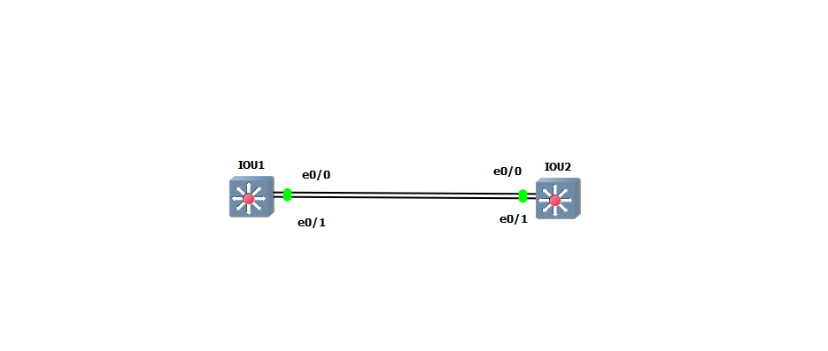
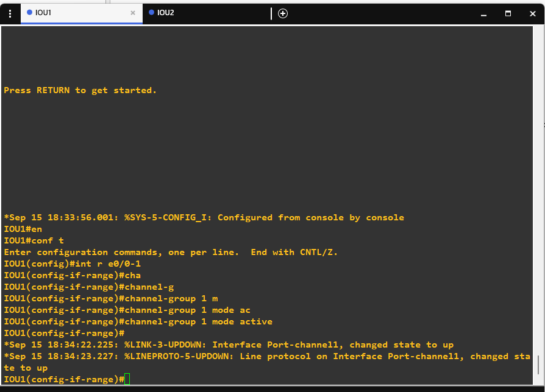
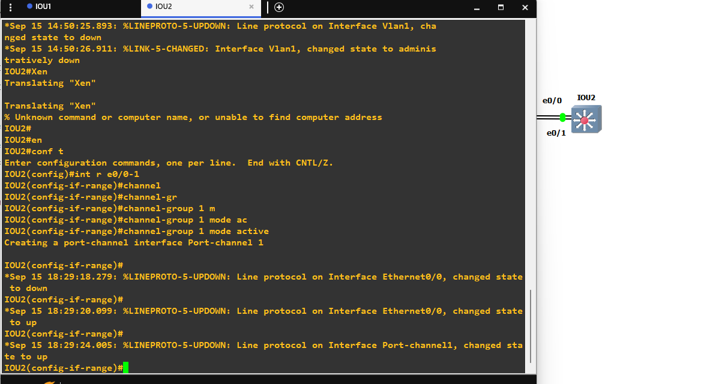
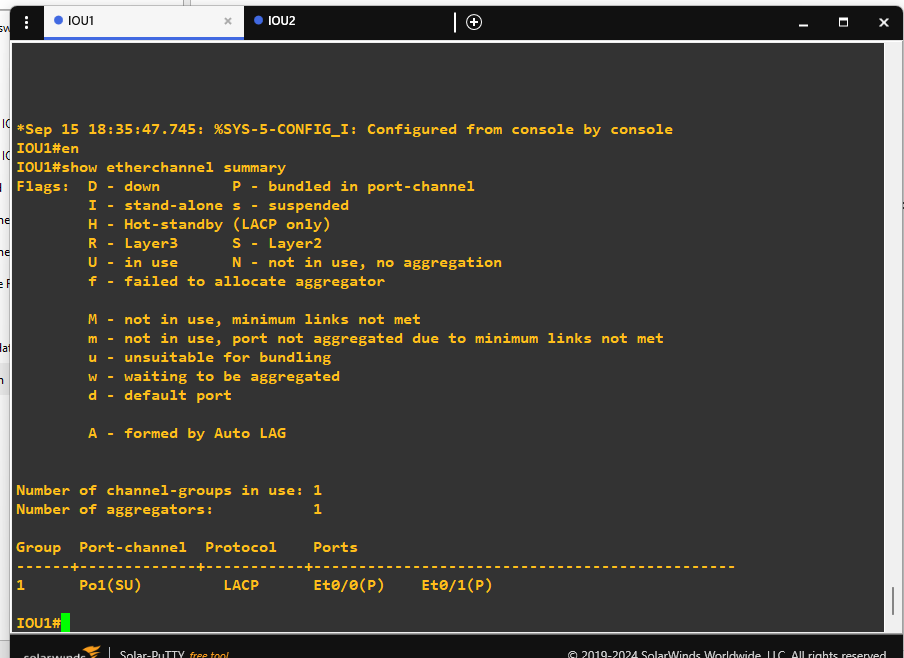
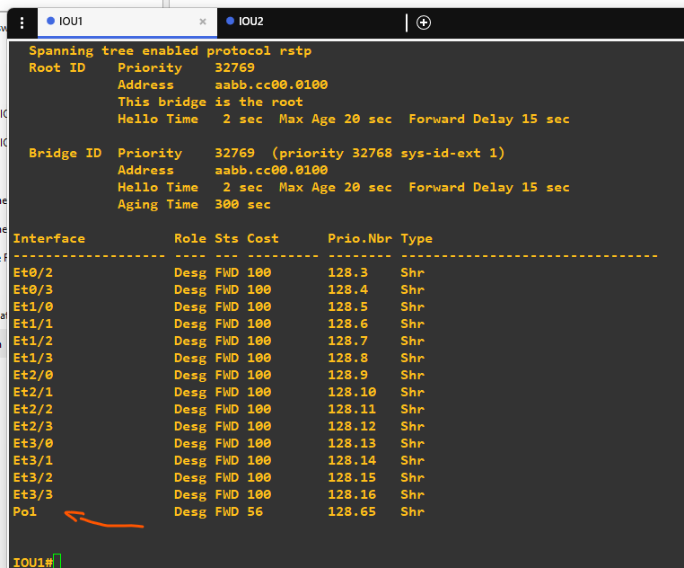

# EtherChannel (LACP)

## Goal
Bundle two parallel physical links between two switches into a single
logical link using LACP (Link Aggregation Control Protocol), to use
the full bandwidth of both links simultaneously instead of having STP
block one of them as a redundant path.

## Topology


- **IOU1** — connected to IOU2 via two parallel links: e0/0 and e0/1
- **IOU2** — connected to IOU1 via the same two links: e0/0 and e0/1

## Devices Configured
- IOU1
- IOU2

## Why EtherChannel
With two parallel physical links between the same two switches and no
EtherChannel, STP treats them as a loop and blocks one of them
entirely, wasting its full bandwidth as a passive backup. EtherChannel
solves this by bundling both physical links into one logical
interface (Port-channel), so STP sees only a single link and no loop
exists — both physical links stay active and share the traffic load.

## Configuration Applied
On both IOU1 and IOU2:
```
interface e0/0
 channel-group 1 mode active
interface e0/1
 channel-group 1 mode active
```
`mode active` enables LACP (IEEE 802.3ad standard, vendor-neutral),
which negotiates the bundle automatically between both switches.

## IOU1 Configuration


## IOU2 Configuration


## EtherChannel Verification


`show etherchannel summary` confirms both e0/0 and e0/1 are bundled
(P flag) into **Po1**, running the **LACP** protocol.

## STP Verification


`show spanning-tree` confirms that **Port-channel1** appears as a
single Designated Forwarding (Desg FWD) interface — e0/0 and e0/1 no
longer appear individually, since they were merged into the bundle.
No port is Blocking, proving both physical links are actively used at
the same time. The Port-channel's STP cost (56) is also lower than a
single link's cost (100), reflecting its higher combined bandwidth.

## Issues Faced
- Initially tried to configure both interfaces at once using
  `interface range e0/01` instead of the correct range syntax
  `interface range e0/0-1`. IOS interpreted this as a single interface
  (Ethernet0/1) rather than a range, so only e0/1 joined the
  EtherChannel while e0/0 was left out — confirmed by
  `show etherchannel summary` showing only one bundled port. Fixed by
  manually configuring `channel-group 1 mode active` on e0/0 as well.
