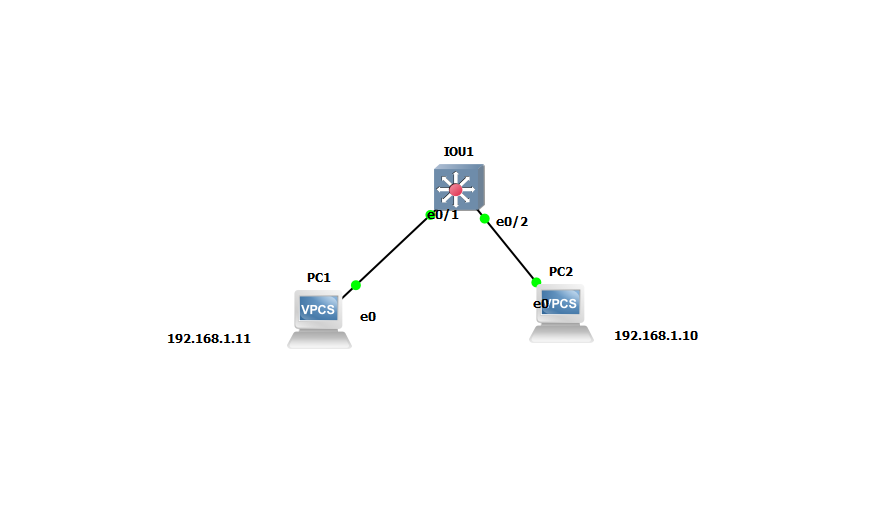
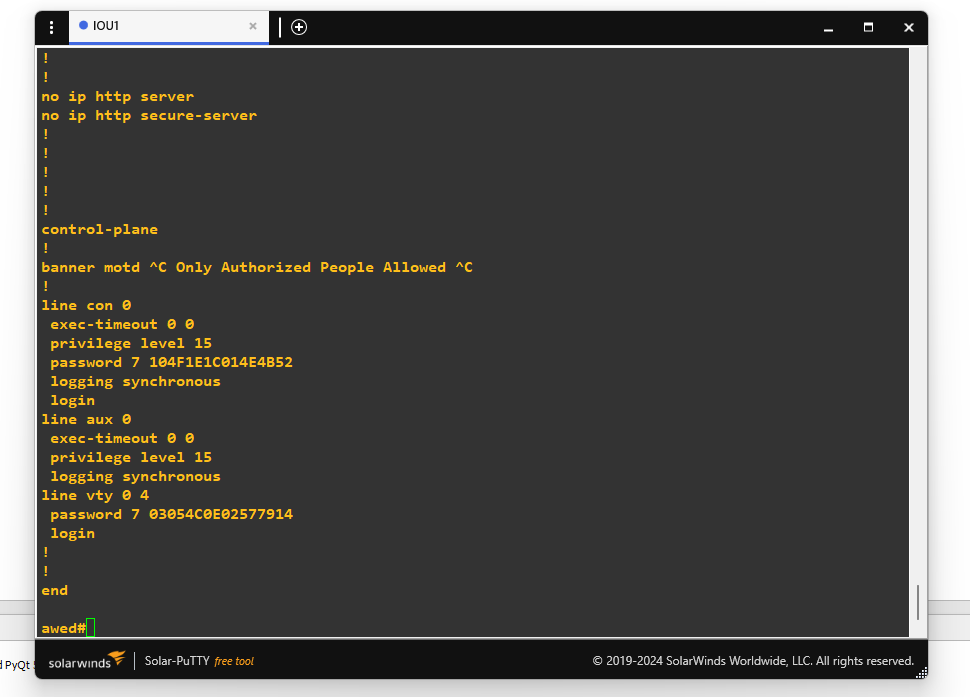
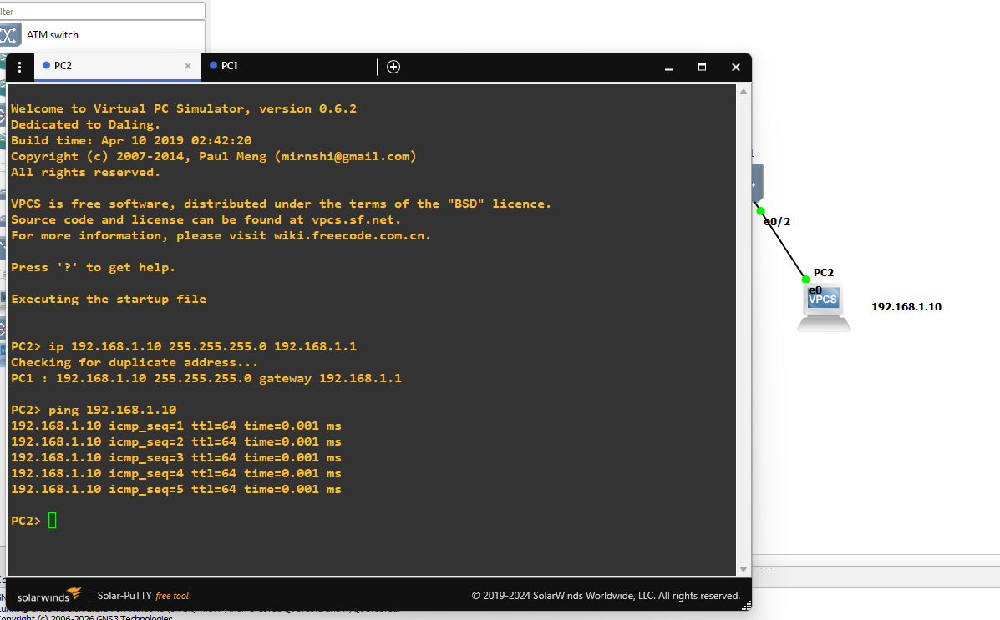

# Basic Device Configuration

## Goal
Apply basic security and management configuration on a Cisco switch,
and verify connectivity between two PCs on the same network.

## Topology

## Devices Configured
- Switch1 (Switch)
- PC1 (192.168.1.11)
- PC2 (192.168.1.10)

## Configuration Applied
- Hostname
- Enable secret (encrypted privileged mode password)
- Console line password + login
- VTY lines password + login (for remote access)
- Login banner (MOTD)
- Password encryption (`service password-encryption`) to protect
  console/VTY passwords, which are plaintext by default

## Configuration Output

## Verification

Successfully pinged from PC1 (192.168.1.11) to PC2 (192.168.1.10).
