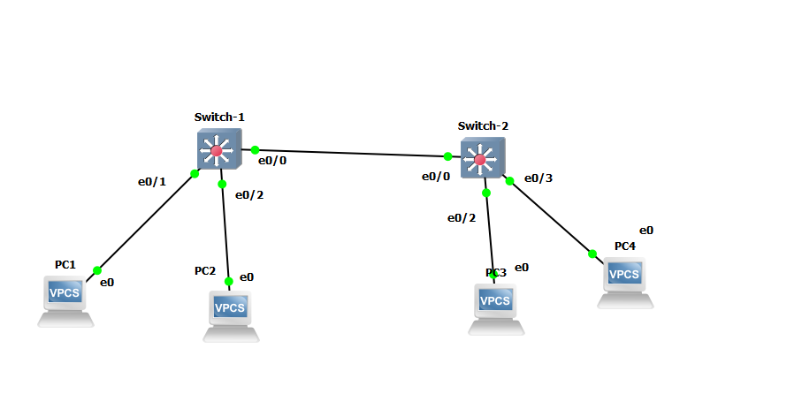
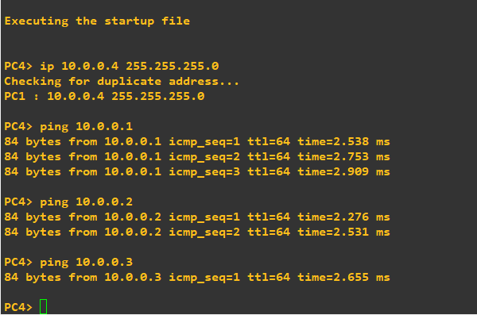
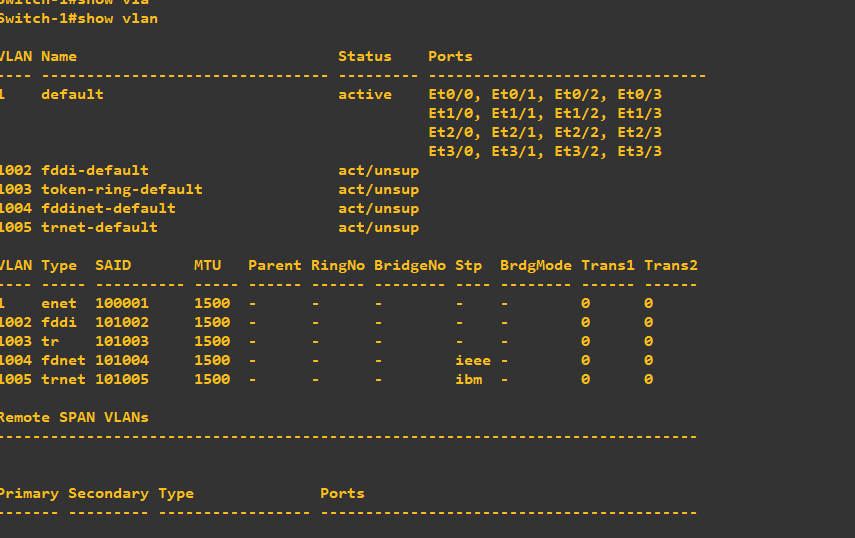
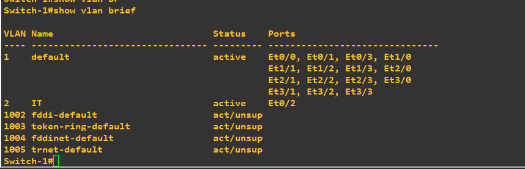
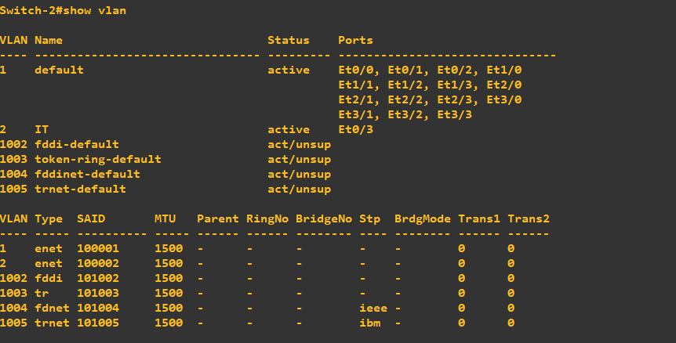
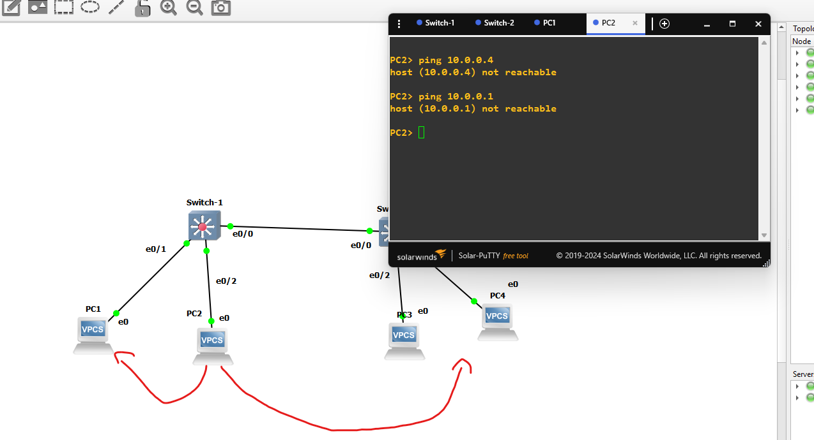
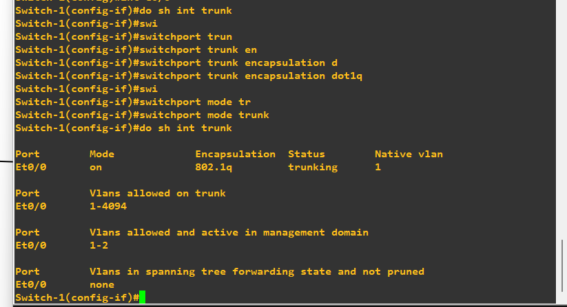
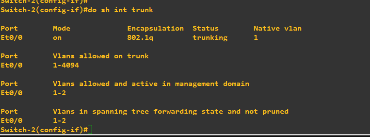
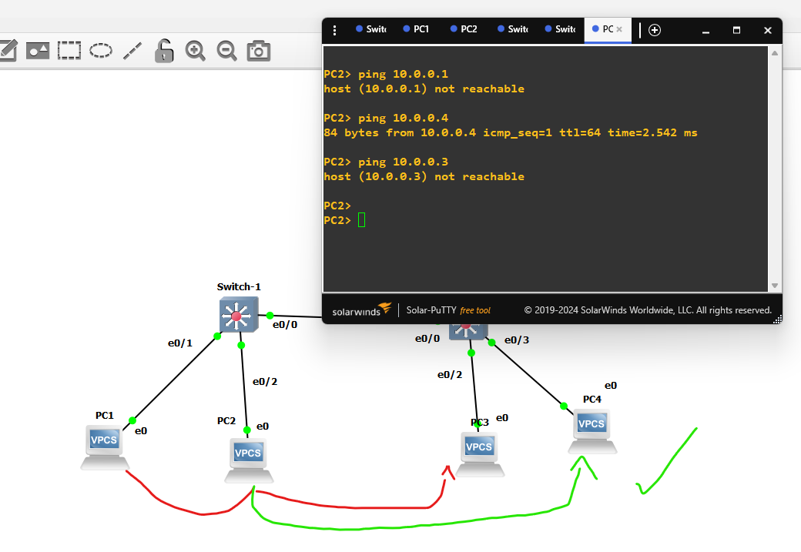

# VLAN Configuration

## Goal
Segment a flat Layer 2 network into separate VLANs to isolate traffic
between devices, then configure a trunk link between two switches so
devices in the same VLAN can still communicate across switches.

## Topology

- **Switch-1** — PC1 (e0/1), PC2 (e0/2), uplink to Switch-2 (e0/0)
- **Switch-2** — PC3 (e0/2), PC4 (e0/3), uplink to Switch-1 (e0/0)
- All devices on the same subnet: 10.0.0.0/24

## Devices Configured
- Switch-1
- Switch-2
- PC1, PC2, PC3, PC4 (VPCS)

## Before VLAN Configuration (Default State)

By default, all switch ports belong to **VLAN 1**, so all four PCs are
in the same broadcast domain and can ping each other freely, even
across the two switches.

## Configuration Applied
- Created **VLAN 2 (IT)** on both Switch-1 and Switch-2
- Switch-1: moved PC2's port (e0/2) into VLAN 2, kept PC1 in the
  default VLAN 1
- Switch-2: moved PC4's port (e0/3) into VLAN 2, kept PC3 in the
  default VLAN 1
- Configured the inter-switch link (e0/0 on both switches) as an
  **802.1Q trunk**, with `switchport nonegotiate` to disable DTP and
  avoid relying on automatic trunk negotiation

## VLAN Verification

`show vlan brief` on both switches confirms VLAN 2 (IT) exists and
contains only the intended ports (e0/2 on Switch-1, e0/3 on Switch-2),
while the rest of the ports stay in VLAN 1.

## VLAN Isolation (Before Trunk)

With VLANs assigned but no trunk configured yet:
- PC1 → PC2: **fails** (different VLANs, same switch)
- PC1 → PC3: **works** (both still VLAN 1)
- PC2 → PC4: **fails** — even though both are in VLAN 2, the
  inter-switch link only carried VLAN 1 traffic at this point, since
  it was still a plain access link.

## Trunk Configuration

Both switches' e0/0 interfaces were configured as 802.1Q trunks,
allowing all VLANs to pass between Switch-1 and Switch-2.

## Final Verification (After Trunk)

- PC2 → PC1: still **fails** (different VLANs — correct isolation)
- PC2 → PC3: still **fails** (different VLANs — correct isolation)
- PC2 → PC4: now **succeeds** ✅ — same VLAN (2), and the trunk link
  now carries VLAN 2 traffic between the two switches.

This confirms VLANs isolate traffic at Layer 2 regardless of IP
subnet, and a trunk link is required to carry multiple VLANs between
switches.

## Issues Faced
- Initially expected PC2 and PC4 to communicate as soon as they were
  both placed in VLAN 2, without realizing the inter-switch link was
  still an access port and only forwarded VLAN 1. This was resolved
  by configuring the link as a trunk.
- The switch-to-switch port negotiated trunking automatically via DTP
  (Dynamic Trunking Protocol) as soon as one side was set to trunk
  mode. To avoid relying on automatic negotiation (a potential VLAN
  hopping / switch spoofing risk), the trunk was configured explicitly
  with `switchport nonegotiate` on both ends.
