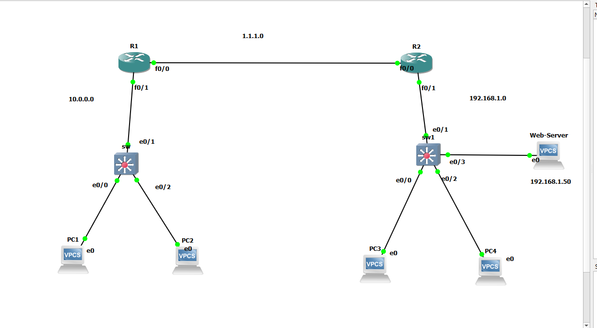
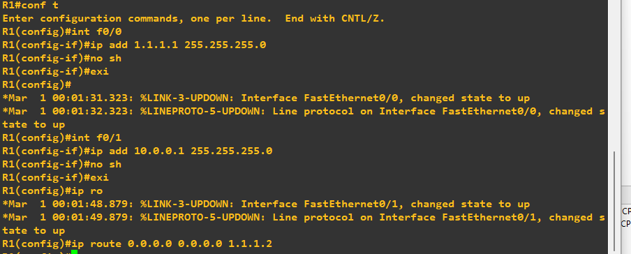
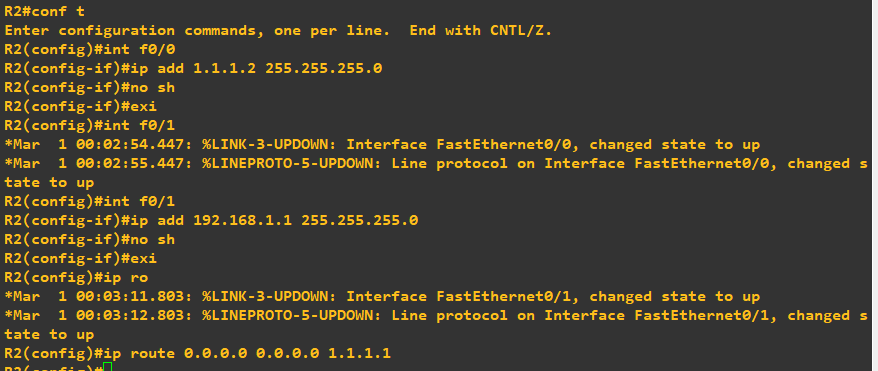
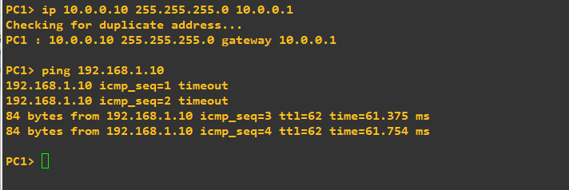
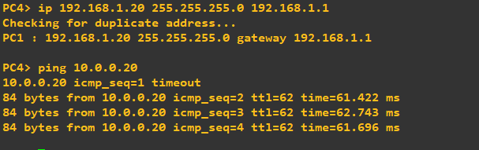
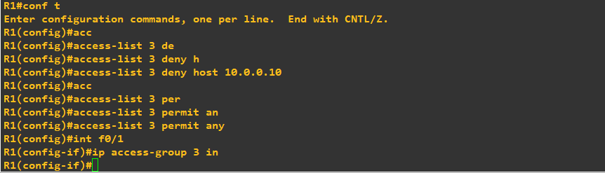
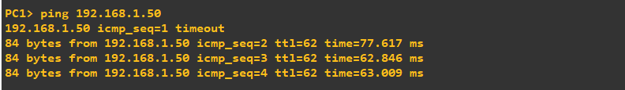
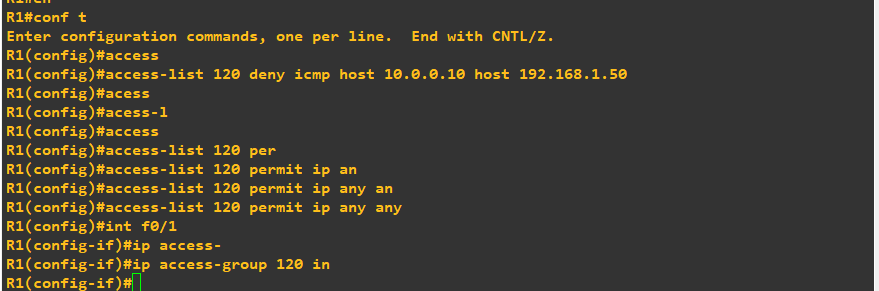
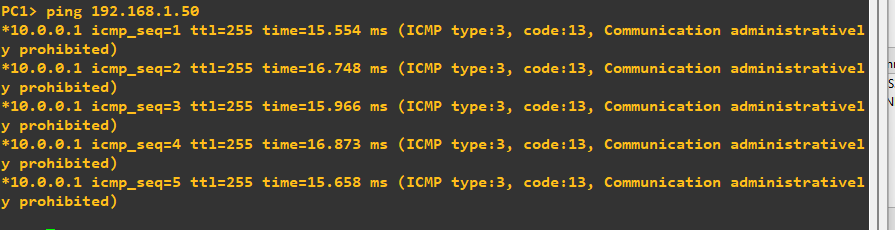
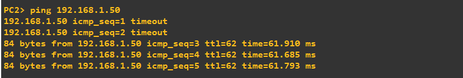

# GNS3 Network Security Project: Standard & Extended ACLs Implementation

## 📌 Project Overview
This project demonstrates the setup, implementation, and verification of Cisco IOS Access Control Lists (ACLs) within a multi-router environment in GNS3. It covers baseline network topology configuration, Standard ACL placement for host restriction, and Extended ACL enforcement for targeted protocol filtering to protect dedicated server resources.

---

## 📐 Network Topology
The network consists of two core routers (R1 and R2), two LAN subnets (`10.0.0.0/24` and `192.168.1.0/24`), multiple PC clients, and a dedicated Web-Server (`192.168.1.50`).

---

## ⚙️ Initial Router Configuration & Baseline Reachability

### 1. Router Interfaces & Static Routing Setup
Initial IP address allocation and static default routes configured on R1 and R2 to ensure end-to-end routing.

* **R1 Configuration:**

* **R2 Configuration:**

### 2. Baseline Reachability Verification
Testing baseline connectivity across subnets before enforcing any security ACL rules.

* **PC1 to LAN 2 Ping:**

* **PC4 to LAN 1 Ping:**

---

## 🛡️ Phase 1: Standard Access Control List (ACL)

### 1. Configuration
Standard ACL (ACL 3) applied inbound on R1 FastEthernet0/1 to block traffic originating from PC1 (`10.0.0.10`).

---

## 🛡️ Phase 2: Extended Access Control List (ACL)

### 1. Pre-Enforcement Reachability Test
Verifying reachability from PC1 (`10.0.0.10`) to the Web-Server (`192.168.1.50`) prior to applying Layer 4/ICMP filtering.

### 2. Configuration
Extended ACL (ACL 120) applied inbound on R1 FastEthernet0/1 to specifically deny ICMP traffic from PC1 (`10.0.0.10`) to the Web-Server (`192.168.1.50`), while permitting all other network traffic.

### 3. Traffic Filtering Verification
* **PC1 Ping Blocked:** ICMP traffic dropped by R1 with `Communication administratively prohibited`.

* **PC2 Ping Permitted:** Traffic from authorized host PC2 (`10.0.0.20`) reaches the Web-Server successfully.

---

## 🔑 Key Technical Findings
1. Standard ACLs evaluate source IP addresses only and should be placed close to the destination network.
2. Extended ACLs evaluate source, destination, and protocols, making inbound placement close to the source optimal.
3. Every ACL ends with an implicit `deny ip any any` rule; explicit `permit` statements are mandatory to prevent unintended network outages.
