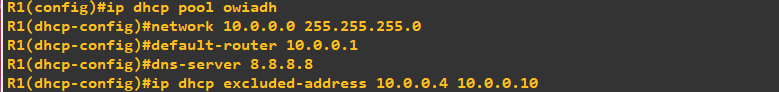
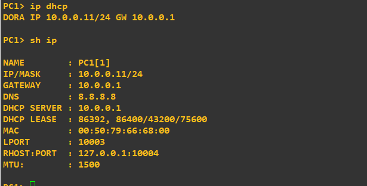
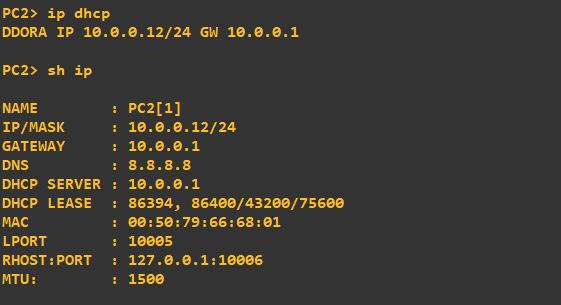
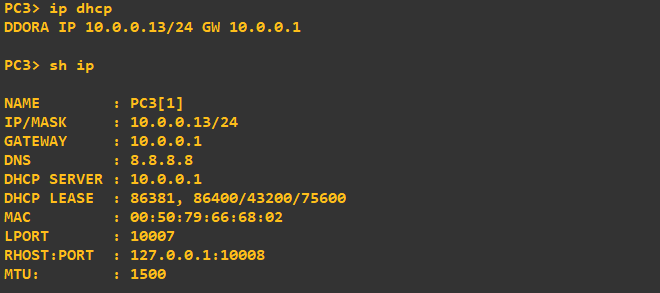

# Cisco IOS Router as DHCP Server Implementation Lab

## Executive Summary
This project presents the deployment and verification of a **Cisco IOS Router as a Dedicated DHCP Server** in a GNS3 enterprise simulation environment. The lab highlights automated network parameter allocation and dynamic lease enforcement with **IP Conflict Prevention via Address Exclusions**.

---

## 1. Network Topology
The enterprise layout connects the central DHCP Gateway (`R1`) through a Layer 2 Switch (`SW`) to three end-user hosts (`PC1`, `PC2`, `PC3`).

---

## 2. Cisco IOS DHCP Configuration
Configuration of the `owiadh` DHCP pool on `R1`, including network parameters, default gateway, DNS server, and dynamic IP exclusion ranges (`10.0.0.4` to `10.0.0.10`).

---

## 3. Dynamic IP Allocation & Exclusion Verification

### PC1 DORA & Range Exclusion Test
Verification of `PC1` executing the DORA sequence. The server bypasses the reserved range (`10.0.0.4` – `10.0.0.10`) and leases the first available IP address.

---

### PC2 Lease Verification
Verification of `PC2` requesting network parameters via DHCP and obtaining its assigned lease.

---

### PC3 Lease Verification
Verification of `PC3` completing the DORA process and establishing active network parameters.

---

## 4. Verification Summary Table

| Endpoint Host | Hardware MAC Address | Assigned IP | Default Gateway | DNS Server | Lease Status |
| :--- | :--- | :--- | :--- | :--- | :--- |
| **PC1** | `00:50:79:66:68:00` | `10.0.0.11` | `10.0.0.1` | `8.8.8.8` | Active (Exclusion Enforced) |
| **PC2** | `00:50:79:66:68:01` | `10.0.0.12` | `10.0.0.1` | `8.8.8.8` | Active (Exclusion Enforced) |
| **PC3** | `00:50:79:66:68:02` | `10.0.0.13` | `10.0.0.1` | `8.8.8.8` | Active (Exclusion Enforced) |

### Key IOS Monitoring Commands
* `show ip dhcp binding`
* `show ip dhcp pool`
* `show ip dhcp server statistics`
