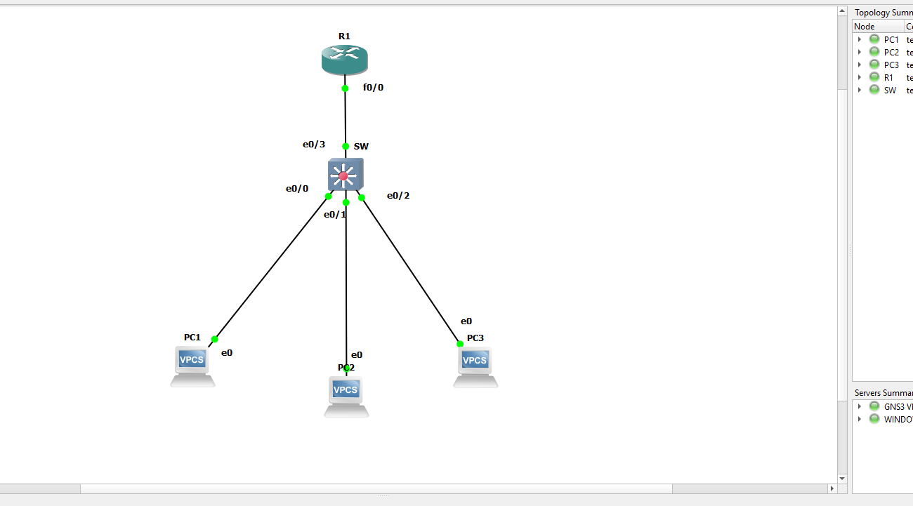

# Cisco IOS Router as DHCP Server Implementation Lab

## Executive Summary
This project demonstrates the deployment, configuration, and verification of a **Cisco IOS Router operating as a Dedicated DHCP Server** in an enterprise network topology simulated via GNS3. The lab highlights automated IPv4 network parameters assignment, default gateway provisioning, DNS server pushing, and **IP Conflict Prevention through DHCP Address Exclusions**.

---

## 1. Network Topology & Architecture
The network infrastructure utilizes a central Cisco IOS Router (`R1`) configured as the DHCP Server, connected via FastEthernet to an Unmanaged Layer 2 Switch (`SW`), which distributes dynamic connectivity to three client host endpoints (`PC1`, `PC2`, `PC3`).



### Topology Component Mapping
* **DHCP Gateway**: Cisco Router `R1` (Interface `FastEthernet0/0` — `10.0.0.1/24`)
* **Layer 2 Infrastructure**: Ethernet Switch (`SW`)
* **Host Clients**: 
  * `PC1` connected via Port `e0/0`
  * `PC2` connected via Port `e0/1`
  * `PC3` connected via Port `e0/2`

---

## 2. Cisco IOS DHCP Configuration
The DHCP pool `owiadh` was configured to dynamically lease IP addresses within the `10.0.0.0/24` subnet. To protect infrastructure devices and prevent IP address collisions, an exclusion range from **`10.0.0.4` to `10.0.0.10`** was configured.


### Complete CLI Configuration (R1)
```cisconet
! Interface Setup
interface FastEthernet0/0
 ip address 10.0.0.1 255.255.255.0
 no shutdown

! DHCP Pool & Exclusion Policy Configuration
ip dhcp pool owiadh
 network 10.0.0.0 255.255.255.0
 default-router 10.0.0.1
 dns-server 8.8.8.8
 ip dhcp excluded-address 10.0.0.4 10.0.0.10
