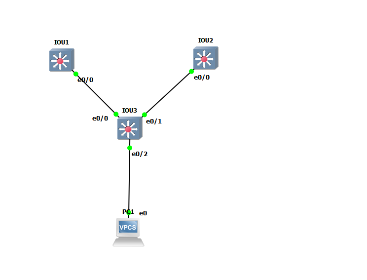
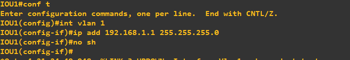
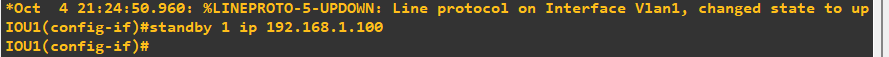
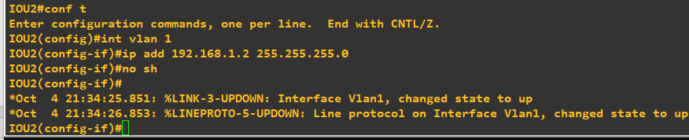
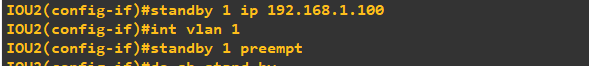
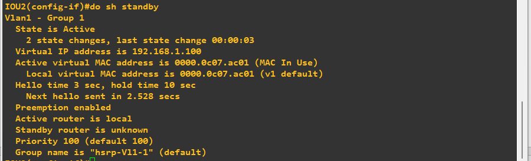
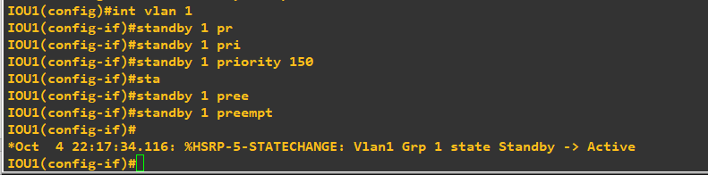
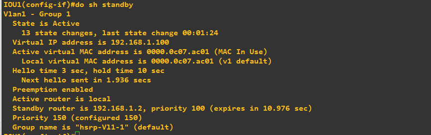
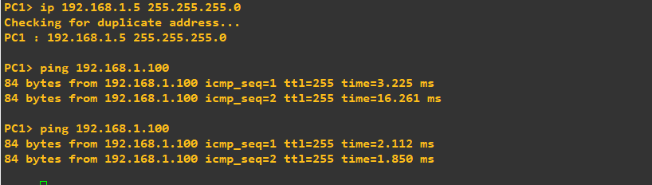

# Enterprise HSRP Gateway Redundancy & Active-Preempt Verification Lab

## Overview
This laboratory experiment demonstrates the configuration and behavior of Cisco's Hot Standby Router Protocol (HSRP) in a multi-layer enterprise LAN environment. It validates first-hop redundancy (FHRP), virtual IP reachability, default election mechanics under tie-breaker scenarios, and priority-based preemption.

---

## Topology Architecture
The design utilizes two Multi-Layer Switches acting as Core/Distribution Layer Gateways (`IOU1` and `IOU2`), connected via an Access Layer Switch (`IOU3` operating in pure Layer 2 switching mode) to deliver gateway redundancy for the client host (`PC1`).

---

## Configuration & Verification Steps

### 1. Primary Gateway (IOU1) SVI Setup
The Switched Virtual Interface (SVI) for VLAN 1 was configured on `IOU1` with the physical IP address `192.168.1.1/24`.

### 2. Primary Gateway (IOU1) Virtual IP Assignment
The HSRP Group 1 Virtual IP `192.168.1.100` was assigned under `interface vlan 1` on `IOU1`.

### 3. Secondary Gateway (IOU2) SVI Setup
The SVI for VLAN 1 was configured on `IOU2` with the physical IP address `192.168.1.2/24`.

### 4. Preemption Enablement on Secondary Gateway (IOU2)
HSRP Virtual IP `192.168.1.100` was assigned on `IOU2` and `standby 1 preempt` was enabled. Because both gateways shared the default priority of `100`, `IOU2` leveraged its higher physical IP address (`192.168.1.2` vs `192.168.1.1`) to win the tie-breaker and claim the Active role.

### 5. Verification of Preempted Active State on IOU2
Verification via HSRP state output confirms `IOU2` transitioned to `Active` state with virtual MAC `0000.0c07.ac01`.

### 6. Manual Priority Override & Preemption on IOU1
To force `IOU1` back as the primary gateway, its priority was explicitly increased to `150` alongside `standby 1 preempt`. This triggered an immediate state transition from `Standby` to `Active`.

### 7. Final HSRP State Verification
Verification on `IOU1` confirms its active status with Priority `150`, while identifying `IOU2` (`192.168.1.2`) as the standby gateway with Priority `100`.

### 8. Client Connectivity Verification
`PC1` was assigned IP address `192.168.1.5/24` with default gateway `192.168.1.100`. End-to-end ICMP reachability to the Virtual IP was successfully verified.

