# Multi-Area OSPF Enterprise Routing Architecture Lab

## Overview
This laboratory project demonstrates the design, deployment, and verification of a **Multi-Area OSPF (Open Shortest Path First)** dynamic routing protocol in an enterprise environment. The lab simulates multi-site WAN interconnections, isolating network domains, reducing SPF algorithm overhead, and maintaining scalable routing topology through an **Area Border Router (ABR)**.

---

## Network Topology & Addressing Table

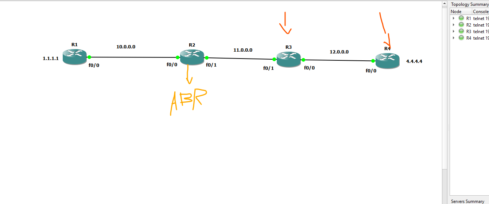

### Topology Architecture
* **Area 0 (Backbone Area):** Connects `R1` and `R2` (`FastEthernet0/0`).
* **Area Border Router (ABR):** `R2` acts as the ABR connecting **Area 0** to **Area 20**.
* **Area 20 (Non-Backbone Area):** Connects `R2` (`FastEthernet0/1`), `R3`, and `R4`.

### Addressing Details
| Device | Interface | IP Address / Mask | OSPF Area | Description |
| :--- | :--- | :--- | :--- | :--- |
| **R1** | `Fa0/0` | `10.0.0.1/24` | Area 0 | Physical Link to R2 |
| **R1** | `Loopback1` | `1.1.1.1/24` | Area 0 | Stable Test Endpoint / Router ID |
| **R2** | `Fa0/0` | `10.0.0.2/24` | Area 0 | Backbone Link to R1 |
| **R2** | `Fa0/1` | `11.0.0.1/24` | Area 20 | Area Border Link to R3 |
| **R3** | `Fa0/1` | `11.0.0.2/24` | Area 20 | Link to R2 (ABR) |
| **R3** | `Fa0/0` | `12.0.0.1/24` | Area 20 | Link to R4 |
| **R4** | `Fa0/0` | `12.0.0.2/24` | Area 20 | Link to R3 |
| **R4** | `Loopback1` | `4.4.4.4/24` | Area 20 | Target Endpoint / Router ID |

---

## Step-by-Step Lab Implementation

### Step 1: Interface IP & Loopback Configuration

#### Router 1 (R1)
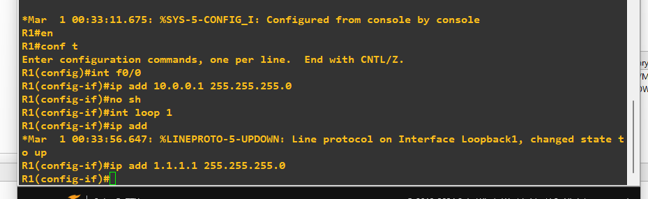

#### Router 2 (R2 - ABR)
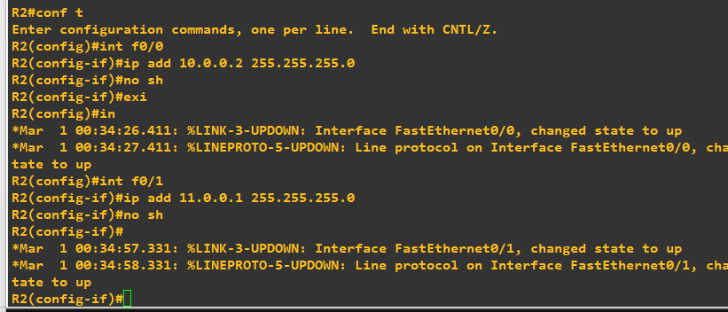

#### Router 3 (R3)
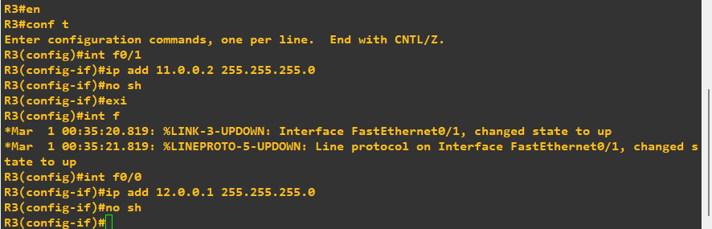

#### Router 4 (R4)
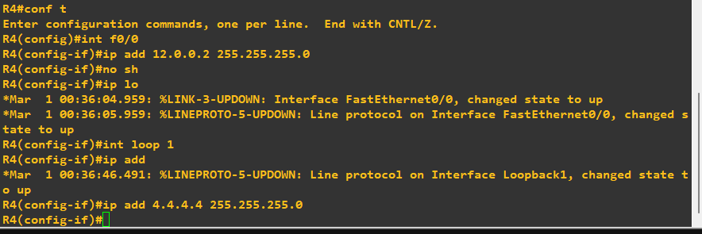

---

### Step 2: Multi-Area OSPF Routing Configuration

#### Router 1 (R1 - Area 0)
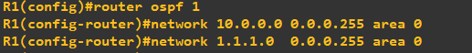

#### Router 2 (R2 - Area Border Router / ABR)
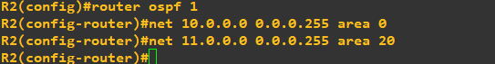

#### Router 3 (R3 - Area 20)
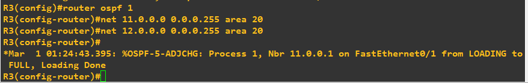

#### Router 4 (R4 - Area 20)
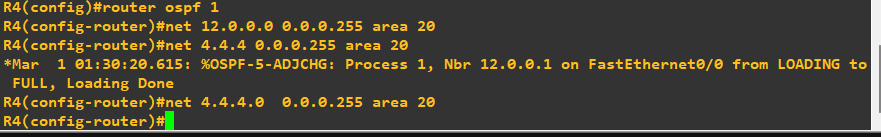

---

## Verification & Database Inspection

### OSPF Database Verification

#### Router 1 OSPF Database
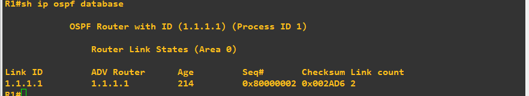

#### Area Border Router (R2) Multi-Area OSPF Database
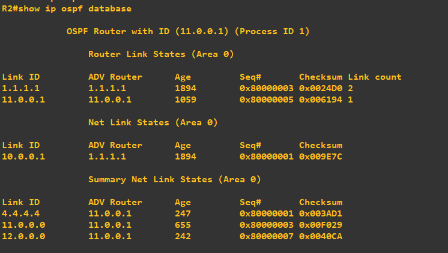
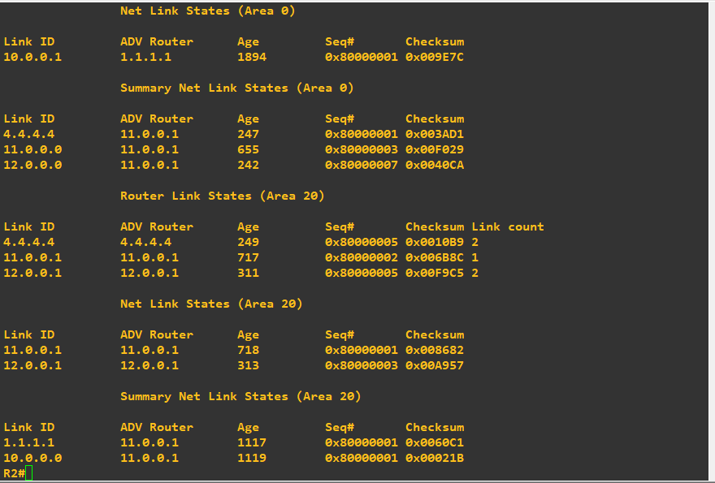

---

## Verification & End-to-End Testing

### Forward Path Verification (R1 to R4 Loopback)
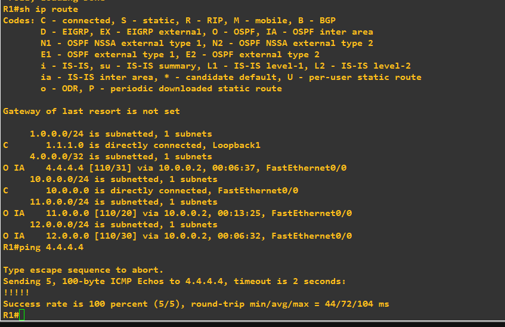

### Reverse Path Verification (R4 to R1 Loopback)
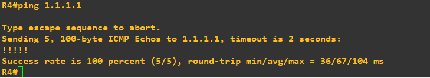

### Key Takeaways & Observations
* **Inter-Area Routing (`O IA`):** `R1` successfully populated its routing table with **Area 20** subnets via the ABR (`R2`).
* **Bidirectional Reachability:** ICMP echo requests reached a **100% success rate (5/5)** in both directions.
* **Fault Isolation:** Multi-Area segmentation limits SPF algorithm re-computations to localized areas, preventing domain-wide CPU/RAM spikes during link stability events.
