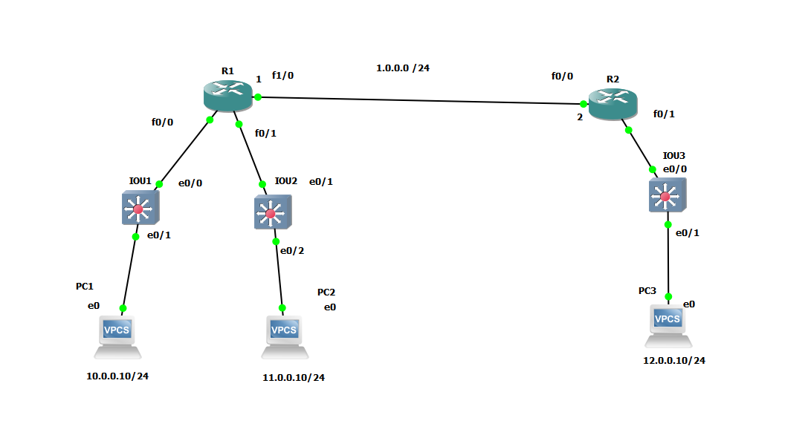
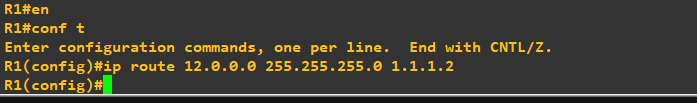

# 🌐 Static Routing Configuration & Verification Lab

This repository demonstrates the step-by-step implementation and verification of **IPv4 Static Routing** between routers `R1` and `R2`.

---

## 1. Network Topology



**Description:**
The topology consists of two Cisco Routers (`R1` and `R2`) connected via a WAN link (`1.0.0.0/24`). 
* `R1` connects to two internal networks: `10.0.0.0/24` (via Switch `IOU1`) and `11.0.0.0/24` (via Switch `IOU2`).
* `R2` connects to an internal network: `12.0.0.0/24` (via Switch `IOU3`).

---

## 2. Router 1 Static Route Configuration



**Description:**
Static route configured on **Router 1 (`R1`)** to allow traffic destined for network `12.0.0.0/24` to be forwarded to `R2` via next-hop IP address `1.1.1.2`:

```cisco
R1# configure terminal
R1(config)# ip route 12.0.0.0 255.255.255.0 1.1.1.2
3. Router 2 Static Route Configuration
Description:
Static routes configured on Router 2 (R2) to allow traffic destined for networks 10.0.0.0/24 and 11.0.0.0/24 to be forwarded to R1 via next-hop IP address 1.1.1.1:

Cisco CLI
R2# configure terminal
R2(config)# ip route 10.0.0.0 255.255.255.0 1.1.1.1
R2(config)# ip route 11.0.0.0 255.255.255.0 1.1.1.1

4. Connectivity Verification: PC1 to PC3
Description:
Ping test executed from PC1 (10.0.0.10) to PC3 (12.0.0.10).

Result: Successful ICMP echo replies received with 0% packet loss, confirming active routing from R1 to R2.

5. Connectivity Verification: PC3 to PC1 & PC2
Description:
Ping tests executed from PC3 (12.0.0.10) to both PC1 (10.0.0.10) and PC2 (11.0.0.10).

Result: Successful ICMP echo replies received for both destination IPs, confirming full bidirectional reachability across all configured static routes.
